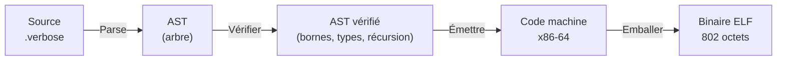
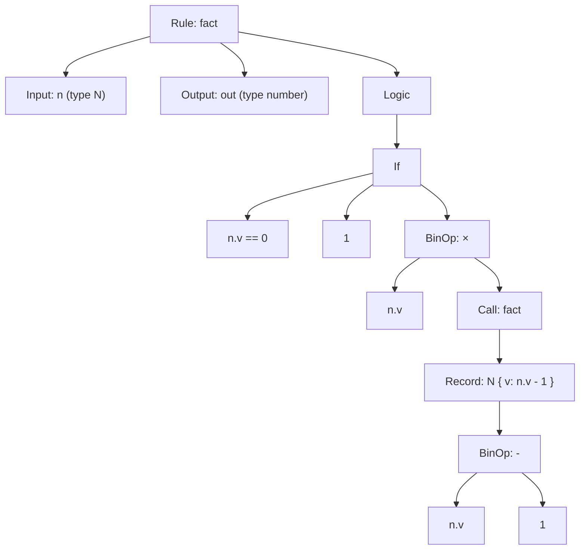
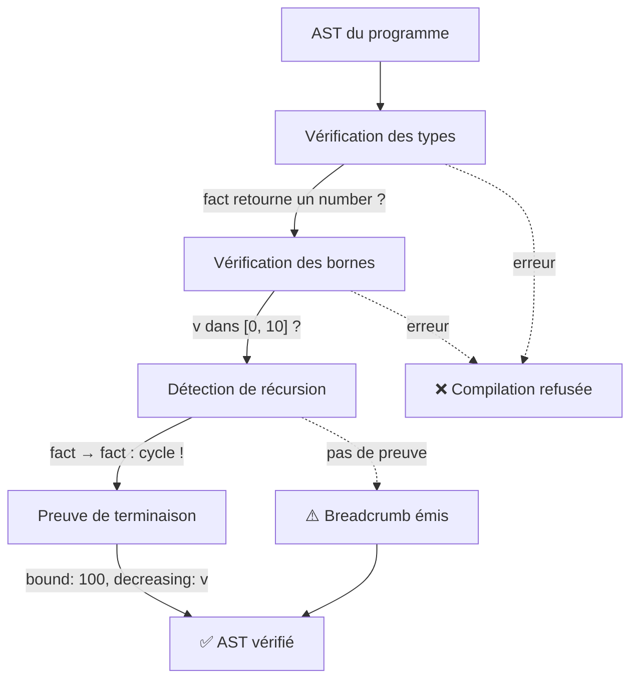
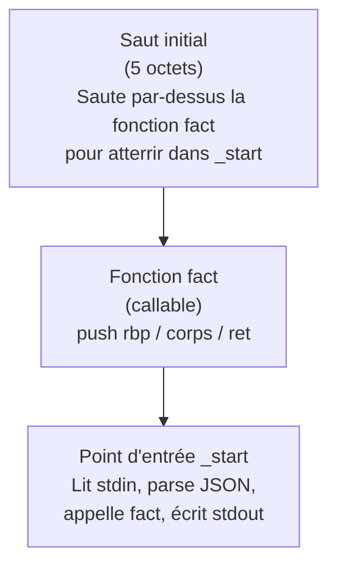
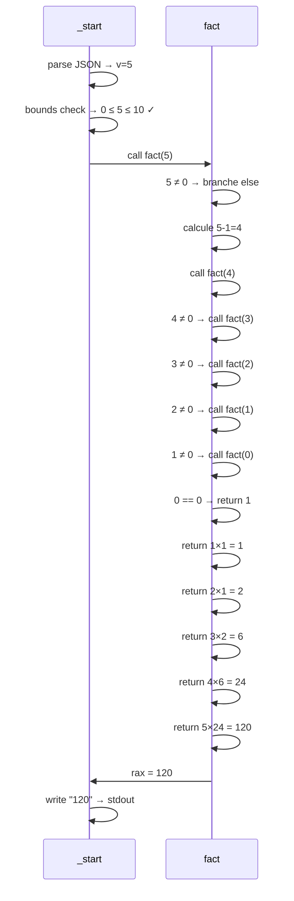

# De l'idée au binaire — ou comment 30 lignes deviennent 802 octets

Lundi 25 mai 2026, il fait 35° dehors en plein mois de mai. Parfait pour les climatosceptiques.

Je lance un ordre à Claude. Je lui demande, là, maintenant, de faire une réponse HTTP simple en verbose. Il analyse ce qu'il manque — l'AST récursif, les types sommes, la gestion d'état. Sur le coup, c'est du chinois pour moi. Je lui dis : OK, mais garde bien à l'esprit nos piliers. Le code déclare l'intention. Le compilateur vérifie. Le binaire ne dérive pas.

Quelques minutes plus tard, c'est là. Un binaire pur natif, qui répond avec un compteur simple. 937 octets. Pas d'interpréteur, pas de runtime, pas de garbage collector. Juste un exécutable qui fait ce que le source dit qu'il fait.

Et là je me dis que quelque chose se passe.

Une idée que j'ai eue il y a deux mois semble se réaliser sous mes yeux. À la base, je voulais faire un langage pour l'IA — pas forcément si puissant. Un langage simple, déclaratif, que l'IA puisse générer correctement du premier coup parce que les contraintes sont dans la grammaire, pas dans la tête du développeur. Mais il faut se le dire : le résultat est là, et il va plus loin que prévu.

Aujourd'hui, on a le compilateur `verbosec`. Il prend du verbose, il produit un ELF x86-64. Ça marche. Mais demain ? Si un LLM comprend le compilateur — s'il comprend comment les déclarations se traduisent en registres, comment les bornes déclarées deviennent des checks runtime, comment un `fold_bytes` produit une boucle native — qu'est-ce qui l'empêche de produire du code natif binaire directement ? Sans intermédiaire. Sans compilateur. La déclaration d'intention du développeur, traduite en octets exécutables par une machine qui comprend les deux côtés.

C'est peut-être une utopie. Peut-être pas. Je n'ai pas la réponse. Mais le chemin pour y arriver passe par un truc : comprendre ce qui se passe vraiment entre le source et le binaire. Et ça, personne ne l'explique accessiblement.

Je m'appelle Yoan Roblet. 41 ans. Je n'ai pas fait d'études en informatique. J'ai 20 ans de métier, du DevOps, de l'infra, du code — mais pas de thèse, pas de diplôme en compilation. Verbose, c'est un projet que je pilote avec l'aide de l'IA. Je n'ai pas la prétention que c'est moi qui tape chaque ligne. Mais sans l'IA, je ne serais jamais parti dans cette aventure seul. Et sans ma direction, mes choix d'architecture, mes refus quand le résultat n'est pas aligné avec la philosophie — il n'y aurait rien non plus.

À partir d'aujourd'hui, je vais aussi moi, me former. Grâce à verbose. Des articles seront publiés régulièrement pour expliquer le raisonnement derrière chaque étape technique. Avec des schémas, des exemples concrets, des dumps hexadécimaux annotés. Chaque article sera un vrai sujet — pas du marketing, pas des release-notes, un sujet qu'on peut étudier.

Je le fais pour le fun. Et si ça vous plaît, tant mieux.

Bonne lecture.

---

## Commençons. 10 lignes, 802 octets.

Le point d'entrée le plus simple : un programme qui calcule la factorielle d'un nombre. Le compilateur verbose produit un binaire ELF de **802 octets**. On va suivre le chemin complet — du source aux octets — et comprendre ce qui se passe à chaque étape.

Si vous ne savez pas ce qu'est un registre, une pile, ou un fichier ELF : c'est normal, et c'est le but de cet article. Chaque concept sera expliqué quand il apparaît. Les prochains articles de la série approfondiront chacun d'eux.

### Le source

Le fichier complet fait 51 lignes (avec les commentaires et les métadonnées). Mais le cœur du programme, c'est ça :

```verbose
concept N
  fields:
    v : number [0, 10]

rule fact
  input:
    n : N
  output:
    out : number
  logic:
    out = if n.v == 0 then 1 else n.v * fact(N { v: n.v - 1 })
```

Dix lignes. C'est tout ce que le développeur écrit. Le compilateur s'occupe du reste. Regardons ce qu'on a déclaré :

- Un **concept** `N` — c'est un type de données. Il a un champ `v` qui est un nombre **borné entre 0 et 10**. Cette borne n'est pas un commentaire : le compilateur va la vérifier ET la faire respecter à l'exécution.
- Une **règle** `fact` — c'est une fonction. Elle prend un `N` en entrée, elle retourne un nombre.
- La **logique** : si `v` vaut 0, retourner 1 (c'est le cas de base : `0! = 1`). Sinon, retourner `v × fact(v - 1)` (c'est la récursion : `5! = 5 × 4!`).

Ce qu'on ne déclare **PAS** : comment stocker `v` en mémoire, dans quel registre du processeur le mettre, comment appeler la fonction récursivement, comment formater la sortie, comment construire un exécutable. Le compilateur décide de tout ça.

### Le pipeline de compilation

Avant de plonger dans chaque étape, voici la vue d'ensemble :



Quatre étapes. Pas d'étape intermédiaire type LLVM IR ou assembleur textuel. Le compilateur verbose produit **directement les octets machine** — les instructions que le processeur exécute.

---

## Étape 1 — Parse : du texte à un arbre

Le parser lit le source caractère par caractère et construit un **arbre syntaxique abstrait** (AST). C'est la même chose que tous les compilateurs font : transformer du texte plat en une structure navigable.



Chaque nœud de l'arbre est un type Rust défini dans `src/ast.rs`. Les plus importants pour notre programme :

| Nœud AST | Ce qu'il représente | Exemple dans notre code |
|---|---|---|
| `Concept` | Un type de données avec des champs | `N` avec `v : number [0, 10]` |
| `Rule` | Une fonction avec entrée, sortie, logique | `fact` |
| `Expr::If` | Un branchement conditionnel | `if n.v == 0 then ... else ...` |
| `Expr::Call` | Un appel de fonction | `fact(N { v: n.v - 1 })` |
| `Expr::Binary` | Une opération entre deux valeurs | `n.v * ...` et `n.v - 1` |
| `Expr::Field` | L'accès à un champ | `n.v` (le champ `v` de `n`) |
| `Expr::Record` | La construction d'un concept | `N { v: n.v - 1 }` |

Le champ `v : number [0, 10]` est stocké avec ses **bornes** — pas comme un commentaire, mais comme un attribut structurel du nœud `Field`. Le vérificateur (étape suivante) pourra les lire et le compilateur natif pourra émettre les checks correspondants.

---

## Étape 2 — Vérification : est-ce que ce programme a du sens ?

Le vérificateur (`src/verifier.rs`, 3 500+ lignes) parcourt l'AST et répond à quatre questions avant d'émettre le moindre octet de code machine.



### Types

Est-ce que `fact` retourne bien un `number` ? Le vérificateur suit les deux branches du `if` :
- Branche `then` : retourne `1` (un nombre) ✓
- Branche `else` : retourne `n.v * fact(...)` — multiplication de deux nombres → nombre ✓

### Bornes

`v : number [0, 10]` signifie que `v` ne peut jamais valoir -1, ni 11, ni 1000000. Le vérificateur note cette contrainte. À l'étape suivante (émission native), le compilateur va **insérer un check dans le code machine** : si la valeur est hors bornes, le programme s'arrête immédiatement. Pas de segfault, pas de corruption silencieuse.

### Récursion

`fact` s'appelle elle-même. Le vérificateur détecte ce cycle. Dans un compilateur classique, une récursion non bornée peut faire exploser la pile mémoire. Verbose fait deux choses :

1. Il note que `v` est déclaré `[0, 10]`, donc la profondeur de récursion ne peut pas dépasser 11 niveaux (de 10 jusqu'à 0).
2. Il émet un **breadcrumb** — un message obligatoire qui dit : *"la profondeur est bornée par la plage déclarée, mais ce n'est pas une preuve mathématique de terminaison. Cette preuve arrivera en Phase C."*

C'est un principe fondamental de verbose : **le compilateur dit ce qu'il sait et ce qu'il ne sait pas**. Il ne fait pas semblant.

---

## Étape 3 — Émission native : l'AST devient du code machine

C'est la partie la plus technique et la plus intéressante. Le compilateur parcourt l'AST vérifié et produit des **instructions x86-64** — les instructions que le processeur Intel/AMD de votre machine exécute directement.

### Un mot sur le processeur

> *→ Futur article dédié : "Les 4 registres qu'il faut connaître"*

Pour suivre cette section, il faut savoir trois choses :

1. **Un registre** est un emplacement de stockage ultra-rapide dans le processeur. On en utilise principalement quatre ici :
   - `rdi` — le registre d'**argument** (on y met la valeur à passer à une fonction)
   - `rax` — le registre de **retour** (la fonction y met son résultat)
   - `rbp` — le **pointeur de frame** (il pointe vers la zone mémoire de la fonction en cours)
   - `rsp` — le **pointeur de pile** (il pointe vers le sommet de la pile mémoire)

2. **La pile** est une zone mémoire qui grandit vers le bas. Quand on appelle une fonction, on "empile" un frame (les variables locales de la fonction). Quand la fonction retourne, on "dépile".

3. **Une instruction** est un ordre au processeur. `mov rax, 42` signifie "mets 42 dans le registre rax". `cmp rax, 0` signifie "compare rax à 0". `je .somewhere` signifie "saute à l'adresse `.somewhere` si la comparaison précédente était égale".

### La structure du code émis

Le compilateur verbose construit le code machine de `fact` en trois morceaux :



Pourquoi ce saut initial ? Parce que dans un ELF, l'exécution commence au **point d'entrée** (`_start`). Mais le code de la fonction `fact` est écrit en premier (pour pouvoir résoudre les adresses d'appel). Donc le premier octet du binaire est un `jmp` qui saute par-dessus `fact` pour atterrir dans `_start`.

### Le prologue de `fact` : préparer le terrain

Quand le processeur entre dans `fact`, il faut d'abord préparer l'espace de travail. C'est le **prologue** — quatre instructions, 15 octets :

```
55                    push rbp          ← sauvegarde le frame du parent sur la pile
48 89 E5              mov rbp, rsp      ← notre frame commence ici
48 83 EC 08           sub rsp, 8        ← on réserve 8 octets pour stocker n.v
48 89 7D F8           mov [rbp-8], rdi  ← on copie l'argument (dans rdi) dans notre frame
```

> **Ce qu'il se passe** : le processeur doit savoir où est "chez lui" (son frame) et où était "chez le parent" (le frame de l'appelant). `push rbp` sauvegarde l'ancien frame. `mov rbp, rsp` dit "mon frame commence ici". `sub rsp, 8` réserve de la place pour nos variables (ici, juste `n.v` — un entier de 8 octets). `mov [rbp-8], rdi` copie la valeur d'entrée depuis le registre d'argument vers notre espace réservé.

### Le bounds-check : 38 octets de sécurité

Immédiatement après le prologue, **avant même d'exécuter la logique**, le compilateur insère la vérification des bornes de `v` :

```
49 BA 00 00 00 00     mov r10, 0        ← borne min dans r10
    00 00 00 00
4C 39 D0              cmp rax, r10      ← compare la valeur à la borne min
0F 8C xx xx xx xx     jl .abort         ← si inférieur : on quitte

49 BA 0A 00 00 00     mov r10, 10       ← borne max dans r10
    00 00 00 00
4C 39 D0              cmp rax, r10      ← compare la valeur à la borne max
0F 8F xx xx xx xx     jg .abort         ← si supérieur : on quitte
```

38 octets. C'est le prix de la sécurité. Si quelqu'un envoie `{"v": 1000000}` au programme, le processeur n'exécutera **jamais** le corps de la fonction. Il sautera directement à `.abort` qui fait :

```
mov rax, 60           ← syscall numéro 60 = exit
mov rdi, 1            ← code de sortie 1 (erreur)
syscall               ← le processeur appelle le noyau Linux : exit(1)
```

Sans ce check, la valeur 1 000 000 provoquerait un million d'appels récursifs, dépasserait la pile mémoire, et le programme mourrait avec un `SIGSEGV` (segmentation fault) — un crash silencieux et incompréhensible. Avec le check, le programme dit "non" et s'arrête proprement.

> **C'est ici que verbose est différent.** La borne `[0, 10]` n'est pas un commentaire. C'est une instruction au compilateur : "émets le code qui empêche cette valeur de sortir de cette plage". Le développeur déclare la contrainte. Le compilateur la transforme en octets machine. Le binaire ne dérive pas.

### Le if/then/else : un branchement dans le processeur

La logique `if n.v == 0 then 1 else n.v * fact(N { v: n.v - 1 })` se traduit en :

```
48 8B 45 F8           mov rax, [rbp-8]  ← charge n.v depuis le frame
48 83 F8 00           cmp rax, 0        ← compare n.v à 0
0F 84 xx xx xx xx     je .else          ← si égal → saute à la branche else
                                           (oui, "je" = "jump if equal")
```

> **Attention à la logique inversée** : en verbose, `if n.v == 0 then 1 else ...` — le `then` est le cas "vrai". Mais dans le code machine, le compilateur teste la condition et **saute si elle est vraie** pour atterrir dans le `else`. Le `then` est le code qui continue linéairement. C'est une convention d'émission, pas une erreur.

**Branche then** (n.v == 0, retourner 1) :
```
48 C7 C0 01 00 00 00  mov rax, 1        ← résultat = 1
E9 xx xx xx xx        jmp .end          ← sauter à la fin
```

**Branche else** (n.v ≠ 0, calculer n.v × fact(n.v - 1)) :
```
48 8B 45 F8           mov rax, [rbp-8]  ← charge n.v
48 83 E8 01           sub rax, 1        ← rax = n.v - 1
48 89 C7              mov rdi, rax      ← met le résultat dans rdi (argument pour fact)
E8 xx xx xx xx        call fact         ← appel récursif ! le processeur empile un
                                           nouveau frame et saute au début de fact
```

Quand `call fact` s'exécute, le processeur :
1. Empile l'adresse de retour (l'instruction qui suit le `call`)
2. Saute au début de `fact`
3. `fact` s'exécute avec `n.v - 1` dans `rdi`
4. Quand `fact` fait `ret`, le processeur dépile l'adresse et reprend ici

Après le retour, `rax` contient le résultat de `fact(n.v - 1)`. Il reste à multiplier :

```
48 8B 4D F8           mov rcx, [rbp-8]  ← charge n.v (original, pas n.v-1)
48 F7 E1              mul rcx           ← rax = rax × rcx (= fact(n.v-1) × n.v)
```

### L'épilogue : nettoyer et retourner

```
48 89 EC              mov rsp, rbp      ← restaure le pointeur de pile
5D                    pop rbp           ← restaure le frame du parent
C3                    ret               ← retourne à l'appelant
```

3 instructions, 5 octets. Le processeur revient là d'où il a été appelé, avec le résultat dans `rax`.

### La résolution des adresses : le problème du `call`

L'instruction `call fact` (opcode `0xE8`) a besoin de l'adresse de `fact` — plus précisément, la **distance** en octets entre l'instruction `call` et le début de `fact` (on appelle ça un `rel32` : relatif, 32 bits).

Problème : quand le compilateur émet le code de `fact`, il ne connaît pas encore la taille totale du code. Comment écrire l'adresse avant de connaître la taille ?

**Solution : deux passes.**

1. **Passe 1** : émet le code avec des adresses à zéro (`call 0x00000000`). Mesure la taille.
2. **Passe 2** : maintenant qu'on connaît la taille, calcule les vraies distances. Réémet le code avec les bonnes adresses.

C'est exactement ce que fait `emit_self_recursive_program()` dans `native.rs:3401-3447`. Cette technique existe depuis les années 1960 — c'est fondamental en compilation.

---

## Étape 4 — Le binaire ELF : 120 octets d'emballage

Le code machine est prêt (682 octets). Mais un fichier exécutable Linux n'est pas juste du code brut. Il faut un **en-tête ELF** qui dit au système d'exploitation : "je suis un programme x86-64, charge-moi en mémoire à cette adresse, et commence l'exécution ici."

> *→ Futur article dédié : "Anatomie d'un binaire Linux"*

### Structure des 802 octets

```
┌────────────────────────────────────────┐
│ ELF Header          64 octets          │  ← "je suis un ELF x86-64"
├────────────────────────────────────────┤
│ Program Header      56 octets          │  ← "charge tout en mémoire à 0x400000"
├────────────────────────────────────────┤
│ Code machine        682 octets         │  ← le vrai programme
│  ├─ Saut initial        5 octets       │
│  ├─ Fonction fact      ~280 octets     │
│  ├─ Point d'entrée     ~300 octets     │
│  └─ Données statiques  ~100 octets     │
└────────────────────────────────────────┘
```

### Les 16 premiers octets (magic ELF)

```
7F 45 4C 46           ← les 4 octets magiques : 0x7F puis "ELF" en ASCII
02                    ← 64-bit (02 = 64, 01 = 32)
01                    ← little-endian (les octets sont dans l'ordre inversé)
01                    ← version ELF 1
03                    ← ABI System V (l'ABI standard de Linux)
00 00 00 00 00 00 00 00  ← padding (octets inutilisés)
```

Si vous ouvrez le binaire dans un éditeur hexadécimal, les 4 premiers octets seront **toujours** `7F 45 4C 46`. C'est comme ça que Linux sait qu'un fichier est un exécutable ELF — avant même de lire le reste.

### Le Program Header : une seule instruction au noyau

```
01 00 00 00           ← type PT_LOAD : "charge ce segment en mémoire"
05 00 00 00           ← flags PF_R | PF_X : "lecture + exécution" (pas d'écriture)
00 00 00 00 00 00 00 00  ← offset 0 : charge depuis le début du fichier
00 00 40 00 00 00 00 00  ← adresse virtuelle 0x400000 (adresse standard Linux)
```

Un seul segment. Un seul `PT_LOAD`. Pas de sections `.data`, `.bss`, `.rodata`. Pas de table de symboles. Pas de dynamic linking. Le binaire est un bloc monolithique : on charge tout en mémoire à `0x400000` et on exécute.

Le point d'entrée (`e_entry`) est à `0x400078` — c'est l'adresse `0x400000 + 120` (120 = 64 octets d'ELF header + 56 octets de Program Header). C'est là que `_start` commence.

### Ce qui manque (et pourquoi c'est bien)

Un binaire C compilé avec GCC contient typiquement :
- Un dynamic linker (`/lib64/ld-linux-x86-64.so.2`)
- Des sections `.plt`, `.got` pour les appels de bibliothèque
- La libc (malloc, printf, etc.)
- Des informations de debug, des symboles
- Taille minimale : **~15 000 octets**

Notre binaire verbose : **802 octets**. Pas de libc, pas de dynamic linking, pas de symboles. Les deux seuls syscalls utilisés sont `read` (lire stdin), `write` (écrire stdout) et `exit` (quitter). Le programme parle directement au noyau Linux.

---

## Étape 5 — Exécution

```bash
$ echo '{"v":5}' | ./fact
120

$ echo '{"v":10}' | ./fact
3628800

$ echo '{"v":0}' | ./fact
1

$ echo '{"v":11}' | ./fact
$ echo $?
1
```

Le dernier cas est le plus intéressant : `{"v":11}` dépasse la borne `[0, 10]`. Le bounds-check (nos 38 octets de sécurité) intercepte la valeur avant que la fonction ne commence. Le programme retourne le code d'erreur 1. Pas de message d'erreur verbeux — juste un arrêt net. La borne déclarée dans le source a produit un check machine qui a protégé l'exécution.

### Ce qui se passe dans le processeur pour `{"v":5}`



6 frames empilés au maximum. Chaque frame fait 24 octets (16 d'alignement + 8 pour `n.v`). Profondeur max pour `[0, 10]` : 11 frames = 264 octets de pile. Linux alloue 8 Mo de pile par défaut. On en utilise 0,003%.

---

## Ce qu'on a couvert

En résumé :

| Étape | Ce qui se passe | Taille |
|-------|-----------------|--------|
| Source | Le développeur déclare l'intention | 10 lignes |
| Parse | Le texte devient un arbre (AST) | en mémoire |
| Vérification | Types, bornes, récursion, terminaison | en mémoire |
| Émission native | L'AST devient des instructions x86-64 | 682 octets |
| ELF | Le code machine est emballé pour Linux | +120 octets |
| **Total** | | **802 octets** |

Le développeur a écrit 10 lignes. Le compilateur a produit un binaire autonome qui :
- Calcule des factorielles avec de la vraie récursion (appels sur la pile, pas de l'inlining)
- Refuse les entrées hors bornes avant d'exécuter quoi que ce soit
- N'a aucune dépendance (pas de libc, pas de runtime)
- Tient dans 802 octets

---

## À suivre

Cet article est le premier d'une série. Les prochains plongeront dans chaque concept avec le niveau de détail qu'il mérite :

- **#2 — Le bounds-check en détail** : pourquoi `exit(1)` avant `SIGSEGV`, comment 38 octets de code machine empêchent un million de frames récursifs, et ce que ça coûte en performance
- **#3 — Les registres et la pile** : comment le processeur gère la mémoire, pourquoi `push rbp` / `pop rbp` existe, et comment lire un dump de pile
- **#4 — Le format ELF** : anatomie complète d'un binaire Linux, octet par octet
- **#5 — Les types sommes en arène** : comment `concept_group` (Phase B) représente des listes chaînées et des arbres de syntaxe en mémoire native
- **#6 — Le tokenizer sans runtime** : comment `fold_bytes` + `byte_at` + short-circuit `and`/`or` composent un scanner complet en ELF pur

Chaque article sera publié sur [arcker.org](https://arcker.org) avec le source verbose, les schémas, et les dumps annotés.

---

*Verbose est open source : [github.com/verbose-org/verbose](https://github.com/verbose-org/verbose)*
*Version utilisée dans cet article : v0.5.0*
*Série : "Verbose — comprendre ce qui se passe vraiment" — article #1*
