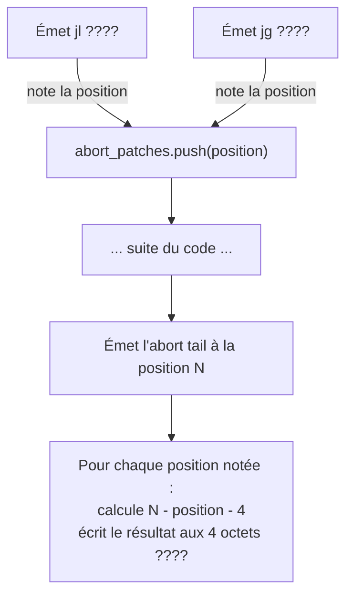

# 38 octets de sécurité — comment verbose empêche un million de stack frames

Dans l'article précédent, on a vu que le binaire factorial faisait 802 octets. Parmi eux, **38 octets** servent exclusivement à une chose : vérifier que la valeur d'entrée respecte les bornes déclarées *avant* d'exécuter la moindre ligne de logique.

Ces 38 octets, c'est la différence entre un programme qui dit "non" proprement et un programme qui meurt dans un crash incompréhensible.

---

## Le problème : qu'est-ce qui se passe sans bounds-check ?

Imaginons qu'on retire les bornes `[0, 10]` de notre champ `v` :

```verbose
concept N
  fields:
    v : number       ← pas de bornes déclarées
```

Si quelqu'un envoie `{"v": 1000000}`, le programme appelle `fact(1000000)`, qui appelle `fact(999999)`, qui appelle `fact(999998)`, et ainsi de suite — un million d'appels récursifs.

Chaque appel empile un **frame** sur la pile (les 24 octets qu'on a vus dans l'article #1 : sauvegarde de `rbp` + variable locale). Un million de frames × 24 octets = **24 Mo** de pile.

Linux alloue par défaut **8 Mo** de pile. Résultat :

```
$ echo '{"v":1000000}' | ./fact
Segmentation fault (core dumped)
```

`SIGSEGV`. Le programme meurt. Pas de message d'erreur utile. Pas de code de retour exploitable. Juste "segfault" — le signal universel de "quelque chose a débordé quelque part, bonne chance pour trouver quoi".

> *→ Futur article dédié : "Les registres et la pile" — comment fonctionne le stack overflow*

---

## La solution verbose : déclarer, vérifier, rejeter

En verbose, on écrit :

```verbose
v : number [0, 10]
```

Ce n'est pas un commentaire. Ce n'est pas une annotation optionnelle. C'est une **instruction au compilateur** : "émets le code machine qui empêche cette valeur d'être en dehors de `[0, 10]`."

Le compilateur produit 38 octets de code machine qui vérifient la valeur **immédiatement après la conversion texte → nombre**, et **avant d'exécuter la logique de la règle**.

Si la valeur est hors bornes : `exit(1)`. Le programme s'arrête. Pas de segfault. Un code d'erreur clair.

---

## Les 38 octets, instruction par instruction

Voici le code machine exact émis par `emit_bounds_check` dans `src/native.rs:1781-1803`. À ce moment de l'exécution, la valeur à vérifier est dans le registre `rax` (elle vient d'être convertie depuis la chaîne d'entrée par `atoi`).

### Check 1 : la borne minimum (v ≥ 0)

```
49 BA 00 00 00 00 00 00 00 00    mov r10, 0
```

On charge la valeur `0` (la borne min) dans le registre `r10`. Pourquoi `r10` et pas directement `cmp rax, 0` ? Parce que l'instruction `cmp` avec un **immédiat 64 bits** n'existe pas en x86-64. Il faut passer par un registre intermédiaire. (`r10` est un registre "scratch" — on peut l'écraser librement.)

> **10 octets** pour charger un nombre. C'est gros pour stocker un `0`, oui. Le compilateur utilise toujours des valeurs 64 bits pour simplifier le code d'émission. Un futur optimiseur pourrait détecter que `0` tient dans 32 bits et utiliser `cmp rax, 0` (3 octets). Mais pour l'instant, clarté > taille.

```
4C 39 D0                          cmp rax, r10
```

Compare `rax` (notre valeur) à `r10` (la borne min). Le processeur met à jour ses **drapeaux internes** (flags) en fonction du résultat : "rax est-il plus petit, égal, ou plus grand que r10 ?"

```
0F 8C xx xx xx xx                 jl .abort
```

**"Jump if Less"** — si `rax < r10` (c'est-à-dire `valeur < 0`), saute à l'étiquette `.abort`. Les `xx` sont un placeholder : l'adresse exacte sera calculée plus tard (voir "le patch différé" ci-dessous).

**Sous-total check 1 : 10 + 3 + 6 = 19 octets**

### Check 2 : la borne maximum (v ≤ 10)

Exactement le même schéma, mais avec `max` au lieu de `min`, et `jg` ("jump if greater") au lieu de `jl` :

```
49 BA 0A 00 00 00 00 00 00 00    mov r10, 10
4C 39 D0                          cmp rax, r10
0F 8F xx xx xx xx                 jg .abort
```

`0A` = 10 en hexadécimal. Si `rax > 10`, on saute à `.abort`.

**Sous-total check 2 : 19 octets**

**Total bounds-check : 19 + 19 = 38 octets**

---

## L'abort tail : 16 octets pour mourir proprement

Si un des deux sauts se déclenche, le processeur atterrit sur **l'abort tail** — un bloc de 16 octets émis une seule fois, à la fin du code :

```
48 C7 C0 3C 00 00 00             mov rax, 60
48 C7 C7 01 00 00 00             mov rdi, 1
0F 05                            syscall
```

Trois instructions :

1. **`mov rax, 60`** — charge le numéro 60 dans `rax`. En Linux x86-64, le numéro 60 = le syscall `exit`. C'est comme appeler `exit()` en C, mais sans passer par la libc.
2. **`mov rdi, 1`** — charge 1 dans `rdi`. C'est l'argument du syscall : le code de sortie. 1 = erreur.
3. **`syscall`** — dit au processeur : "exécute le syscall dont le numéro est dans `rax` avec les arguments dans `rdi`". Le noyau Linux termine le processus avec le code 1.

C'est tout. 16 octets. Le programme meurt proprement, avec un code de sortie exploitable par le script appelant (`$?` en bash).

> **Coût total** : 38 octets par champ borné + 16 octets d'abort tail (partagés entre tous les checks). Pour factorial avec un seul champ borné : 38 + 16 = **54 octets** de sécurité dans un binaire de 802.

---

## Le patch différé : résoudre les adresses en deux temps

Quand le compilateur émet `jl .abort` et `jg .abort`, il ne connaît pas encore l'adresse de `.abort`. Le code est émis séquentiellement — le bounds-check est écrit AVANT l'abort tail. Comment mettre une adresse qu'on ne connaît pas encore ?

**Technique : le patch différé (backpatching)**



1. En émettant `jl`, le compilateur écrit `0F 8C 00 00 00 00` (placeholder à zéro) et note la position de ces 4 zéros dans un vecteur `abort_patches`.
2. Même chose pour `jg`.
3. Plus tard, quand l'abort tail est émis, on connaît enfin sa position (`abort_label`).
4. Le compilateur revient en arrière et **écrase les 4 zéros** avec la vraie distance : `abort_label - (position_du_placeholder + 4)`.

Le `+ 4` est important : les sauts relatifs en x86-64 se calculent par rapport à la fin de l'instruction (`position + 4 octets de l'opérande = fin de l'instruction`), pas par rapport à son début.

Cette technique — écrire un placeholder puis revenir le remplir — s'appelle le **backpatching**. C'est fondamental en compilation. On l'a déjà vu dans l'article #1 pour les adresses de `call fact`.

---

## Quand le check se déclenche-t-il dans le programme ?

Voici l'ordre exact d'exécution dans le binaire factorial :

```mermaid
flowchart TD
    IN["Entrée : {\"v\": 11}"] --> PARSE["Parse JSON\nextrait la valeur texte \"11\""]
    PARSE --> ATOI["atoi : convertit \"11\" → 11\nrésultat dans rax"]
    ATOI --> BC["Bounds-check :\ncmp rax, 0 → OK\ncmp rax, 10 → 11 > 10 !"]
    BC -->|"jg .abort"| ABORT["exit(1)"]
    BC -->|"dans les bornes"| STORE["Stocke rax dans le frame\nmov [rbp-8], rax"]
    STORE --> LOGIC["Logique de la règle :\nif n.v == 0 then 1\nelse n.v * fact(n.v - 1)"]
```

Le bounds-check est un **gardien** : il se place entre la conversion d'entrée et la logique métier. Si l'entrée est invalide, la logique ne s'exécute **jamais**. Pas un seul cycle de CPU n'est gaspillé en calcul sur des données invalides.

---

## Comparaison : comment les autres langages gèrent ça

| Langage | Approche | Résultat pour v=1000000 |
|---------|----------|------------------------|
| **C** | Aucun check. Le développeur est responsable | SIGSEGV (stack overflow) |
| **Rust** | Pas de bounds natif sur les types numériques. Possible via newtype + constructeur validant | Compile time: rien. Runtime: panic si le développeur l'a codé |
| **Python** | Pas de stack overflow (récursion limitée à ~1000 par défaut) | `RecursionError` — propre mais tardif |
| **verbose** | Borne déclarée `[0, 10]`, check émis par le compilateur | `exit(1)` immédiat — jamais de stack overflow |

La différence fondamentale : en verbose, le **développeur déclare** la contrainte dans le source. Le **compilateur émet** le code de vérification. Le **binaire refuse** les données invalides. Personne ne peut "oublier" le check — il fait partie du type.

---

## Le coût : est-ce que 38 octets c'est cher ?

Dans le contexte de notre binaire de 802 octets, 38 octets = **4,7%** du total. C'est significatif en proportion, mais dérisoire en absolu.

En temps d'exécution :
- `mov r10, imm64` = 1 cycle
- `cmp rax, r10` = 1 cycle
- `jl/jg` non-pris = 1 cycle (le processeur prédit "pas de saut" et continue)

Total : **~6 cycles** par vérification (3 instructions × 2 bornes). Sur un processeur à 4 GHz, ça fait **1.5 nanosecondes**. Le coût est invisible.

Le commentaire dans le source (`native.rs:1778-1780`) note qu'on pourrait réduire à ~24 octets en utilisant des opérandes 32 bits quand les bornes sont petites. Mais le gain (14 octets par champ) ne justifie pas la complexité supplémentaire pour l'instant. Clarté du code d'émission > micro-optimisation de taille.

---

## Ce qu'on a appris

1. **38 octets = 2 × (mov + cmp + jcc)**. Deux comparaisons : borne min, borne max. Si l'une échoue, saut vers l'abort.
2. **L'abort tail est partagé** : un seul bloc de 16 octets (`exit(1)`) sert tous les checks du programme.
3. **Le backpatching** résout le problème "je ne connais pas l'adresse de la cible quand j'émets le saut" — placeholder + correction arrière.
4. **Le check est un gardien** : il s'exécute après la conversion d'entrée, avant la logique métier. La règle ne voit que des données valides.
5. **Le coût est négligeable** : ~6 cycles, invisible à l'échelle d'une exécution normale.

La prochaine étape : l'article #3 plongera dans **les registres et la pile** — comment le processeur organise la mémoire, pourquoi `push rbp / pop rbp` existe, et comment lire un dump de pile quand quelque chose ne va pas.

---

*Verbose est open source : [github.com/verbose-org/verbose](https://github.com/verbose-org/verbose)*
*Version utilisée dans cet article : v0.5.0*
*Série : "Verbose — comprendre ce qui se passe vraiment" — article #2*
