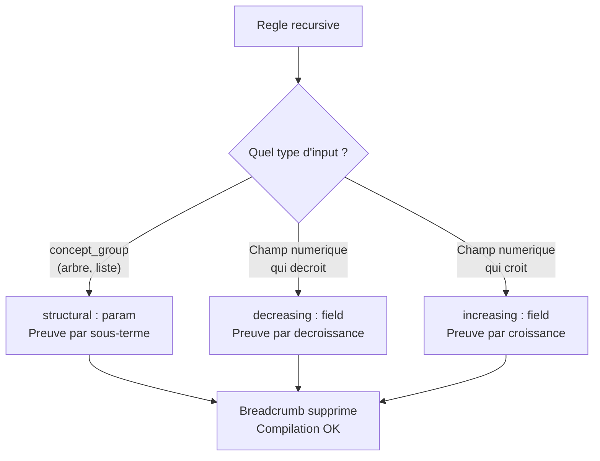

# Comment verbose prouve que votre programme se termine

Dans l'[article #1](/blog/2026-05-25-from-idea-to-binary/), on avait laissé un trou. Le vérificateur détectait la récursion dans `fact`, notait que `v` était borné `[0, 10]`, puis émettait un **breadcrumb** :

> *"La profondeur est bornée par la plage déclarée, mais ce n'est pas une preuve mathématique de terminaison. Cette preuve arrivera en Phase C."*

Phase C est là. Le compilateur verbose peut maintenant **prouver** que certains programmes récursifs terminent — pas juste le supposer. Et quand la preuve tient, le breadcrumb disparaît.

---

## Le problème : pourquoi prouver la terminaison ?

Un programme récursif qui ne termine pas consomme de la pile indéfiniment et finit par crasher (le fameux `SIGSEGV` de l'[article #2](/blog/2026-05-26-bounds-check/)). Le bounds-check empêche les entrées invalides, mais il ne prouve pas que la récursion converge vers un cas de base.

Prenons un exemple volontairement cassé :

```verbose
rule bad_fact
  input: n : N
  output: out : number
  logic:
    out = if n.v == 0 then 1 else n.v * bad_fact(N { v: n.v })
```

`n.v` est passé tel quel — pas `n.v - 1`. La récursion ne progresse jamais vers le cas de base. Avec le bounds-check, le programme ne crashera pas sur une entrée hors bornes. Mais pour `v = 5`, il appellera `bad_fact(5)` indéfiniment jusqu'au stack overflow.

Le bounds-check protège des **entrées invalides**. La preuve de terminaison protège de la **logique invalide**.

---

## Les trois preuves de Phase C

Verbose propose trois manières de prouver la terminaison, selon la structure du programme :



### Preuve 1 — Structural : "chaque appel récursif traite un sous-arbre"

Quand l'entrée est un **type récursif** (arbre, liste chaînée — déclaré via `concept_group`), la preuve structurelle vérifie que chaque appel récursif passe un **sous-terme** de l'entrée, pas l'entrée elle-même.

```verbose
concept_group AST
  concept Expr
    variants:
      Int of (value : number)
      Add of (lhs : Expr, rhs : Expr)

rule eval
  input: e : Expr
  output: out : number
  logic:
    out = match e:
      Int(value) => value
      Add(lhs, rhs) => eval(lhs) + eval(rhs)
  proofs:
    termination:
      structural : e
```

Le vérificateur fait ceci :

1. Identifie que `Expr` est dans un `concept_group` — c'est un type récursif
2. Trouve les **champs auto-référentiels** : `Add` a `lhs : Expr` et `rhs : Expr` — ces champs pointent vers le même type
3. Pour chaque appel récursif (`eval(lhs)`, `eval(rhs)`), vérifie que l'argument est un **binder** issu d'un `match` qui lie un champ auto-référentiel

Pourquoi ça prouve la terminaison ? Un arbre est une structure **finie**. Chaque `match` décompose un noeud en ses sous-arbres. Les sous-arbres sont strictement plus petits que l'arbre d'origine. La récursion descend dans l'arbre et finit par atteindre une feuille (`Int`).

> **Pour les programmeurs fonctionnels** : c'est du pattern matching structurel standard. Haskell et OCaml n'ont pas besoin de le prouver parce que leurs types algébriques sont finis par construction. Verbose le prouve explicitement parce que le langage est conçu pour que le binaire ne puisse pas dériver du source.

### Preuve 2 — Decreasing : "un champ numérique décroît à chaque appel"

Pour le factorial, la preuve est différente. `N` n'est pas un type récursif — c'est un simple record avec un champ `v`. La récursion termine parce que `v` **décroît de 1** à chaque appel, et `v` est borné `[0, 10]`.

```verbose
concept N
  fields:
    v : number [0, 10]

rule fact
  input: n : N
  output: out : number
  logic:
    out = if n.v == 0 then 1 else n.v * fact(N { v: n.v - 1 })
  proofs:
    termination:
      decreasing : v
```

Le vérificateur fait ceci :

1. Trouve le champ `v` sur le concept `N`
2. Vérifie que `v` est de type `Number` **avec une plage déclarée** `[0, 10]`
3. Pour chaque appel récursif `fact(N { v: n.v - 1 })`, vérifie que le champ `v` suit le pattern **`input.field - k`** où `k > 0`

Concrètement, le vérificateur regarde l'expression `n.v - 1` et confirme :
- Le côté gauche est bien `n.v` (accès au champ `v` de l'input `n`)
- Le côté droit est bien `1` (un entier positif)
- L'opération est bien une soustraction

Si quelqu'un écrit `fact(N { v: n.v })` (même valeur, pas de décroissance), le vérificateur refuse :

```
[rule 'bad_fact' / termination.decreasing] recursive call must pass
'n.v - k' (k > 0) for field 'v'; the expression does not match
the decreasing pattern
```

### Preuve 3 — Increasing : "un champ numérique croît vers une borne max"

Le scanner `scan_word` avance dans un texte byte par byte. La position **croît** au lieu de décroître :

```verbose
concept ScanState
  fields:
    source : text [..256]
    pos : number [0, 256]

rule word_length
  input: s : ScanState
  output: out : number
  logic:
    out = if s.pos >= length(s.source) then 0
          else if byte_at(s.source, s.pos) >= 97
                  and byte_at(s.source, s.pos) <= 122
               then 1 + word_length(ScanState { source: s.source, pos: s.pos + 1 })
               else 0
  proofs:
    termination:
      increasing : pos
```

Même logique que `decreasing`, mais avec addition : le vérificateur confirme que `pos` suit le pattern `input.field + k` où `k > 0`. La borne max `256` garantit que la position atteindra la fin.

---

## Qu'est-ce qui change dans le binaire ?

**Rien.**

La preuve de terminaison est un artefact **purement compile-time**. Le vérificateur vérifie la preuve, le compilateur note que la preuve existe, et le breadcrumb est supprimé. Aucun octet supplémentaire n'est émis dans le binaire. Aucun check runtime n'est ajouté pour la récursion elle-même.

Le bounds-check (les 38 octets de l'[article #2](/blog/2026-05-26-bounds-check/)) reste — il protège contre les entrées invalides. Mais il n'a rien à voir avec la preuve de terminaison. Les deux mécanismes sont indépendants :

| Mécanisme | Protège contre | Quand | Coût |
|---|---|---|---|
| **Bounds-check** (article #2) | Entrées hors bornes | Runtime (38 octets) | ~6 cycles |
| **Preuve de terminaison** (cet article) | Logique récursive qui ne converge pas | Compile-time (0 octet) | 0 cycle |

---

## Le breadcrumb : avant et après

C'est le signal le plus visible de Phase C. Avant :

```
$ verbosec factorial.verbose --native fact
native: rule 'fact' is recursive (cycle through 'fact'); the declared
`bound:` is NOT a termination proof for recursion. Runtime stack-overflow
is the only safety signal until Phase C ships structural recursion.
```

Après (avec `decreasing : v`) :

```
$ verbosec factorial.verbose --native fact
[silence — compilation réussie, aucun warning]
```

Le code dans le compilateur (`native.rs:437-448`) :

```rust
let has_termination_proof = rule.proofs.termination.structural.is_some()
    || rule.proofs.termination.decreasing.is_some()
    || rule.proofs.termination.increasing.is_some();
if !has_termination_proof {
    eprintln!("native: rule '{}' is recursive ... [breadcrumb]", rule.name);
}
```

Si au moins une des trois preuves est déclarée ET vérifiée par le vérificateur, le breadcrumb disparaît. Sinon, il reste — le compilateur vous dit honnêtement qu'il ne peut pas garantir la terminaison.

---

## Ce qu'on a appris

1. **Trois preuves, trois patterns** : structural (sous-termes d'un arbre), decreasing (champ numérique qui décroît), increasing (champ numérique qui croît vers une borne). Chacune couvre un type de récursion différent.

2. **La preuve est compile-time, pas runtime.** Zéro octet supplémentaire dans le binaire. Zéro cycle de CPU. Le compilateur vérifie que la logique converge ; le bounds-check (séparé) vérifie que les entrées sont valides.

3. **Le vérificateur est conservateur.** Il ne reconnaît que des patterns simples (`field - k`, `field + k`, binder de match). Si votre expression de décroissance est plus complexe (`n.v / 2`), il refusera. C'est un choix : mieux vaut rejeter un programme valide que d'accepter un programme qui boucle.

4. **Le breadcrumb est un contrat d'honnêteté.** Quand il est là : "je ne sais pas prouver que ça termine". Quand il disparaît : "j'ai vérifié mécaniquement". Il n'y a pas d'état intermédiaire. Le compilateur dit ce qu'il sait.

5. **Le source n'a presque pas changé.** Pour factorial, la seule différence entre "pas de preuve" et "preuve vérifiée" est une ligne : `decreasing : v`. Le programme est le même. Le binaire est le même. Ce qui change, c'est la confiance que le compilateur a dans le programme.

---

*Verbose est open source : [github.com/verbose-org/verbose](https://github.com/verbose-org/verbose)*
*Version utilisée dans cet article : v0.6.0*
*Série : "Verbose — comprendre ce qui se passe vraiment" — article #3*
*Article précédent : [#2 — 38 octets de sécurité](/blog/2026-05-26-bounds-check/)*
