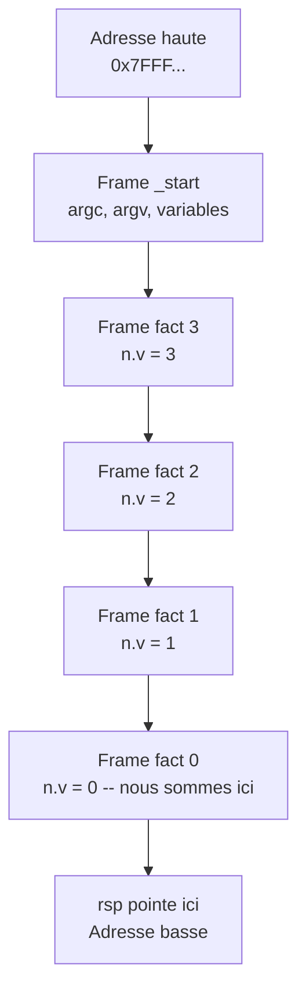

# Les registres et la pile — comment le processeur organise la mémoire

Les articles precedents utilisaient des mots comme "registre", "pile", "frame" sans les definir vraiment. On disait `push rbp` = "sauvegarde le frame du parent" et `mov rdi, rax` = "prepare l'argument". Mais qu'est-ce qu'un registre ? Comment la pile fonctionne-t-elle physiquement ? Pourquoi le processeur a-t-il besoin de ces mecanismes ?

Cet article repond a ces questions en utilisant le binaire factorial comme support.

---

## Les registres : 16 tiroirs ultra-rapides

Un processeur x86-64 a **16 registres a usage general**. Un registre est un emplacement de stockage *a l'interieur du processeur* — pas en memoire RAM. Acceder a un registre prend environ **0.3 nanosecondes**. Acceder a la RAM prend **~100 nanosecondes**. C'est 300 fois plus lent.

Pensez aux registres comme des tiroirs sur votre bureau. La RAM, c'est l'armoire au fond de la piece. Vous pouvez garder 16 choses sur le bureau. Tout le reste est dans l'armoire — accessible, mais il faut se lever.

### Les registres utilises par factorial

| Registre | Role dans factorial | Quand |
|----------|-------------------|-------|
| `rdi` | **Argument d'entree** — contient la valeur passee a `fact()` | Avant chaque `call` |
| `rax` | **Valeur de retour** — contient le resultat apres `ret` | Apres chaque `ret` |
| `rbp` | **Pointeur de frame** — pointe vers le debut de l'espace de travail de la fonction en cours | Pendant toute la fonction |
| `rsp` | **Pointeur de pile** — pointe vers le sommet de la pile | Toujours |
| `rcx` | **Scratch** — utilise temporairement pour la multiplication | Pendant `imul rax, rcx` |
| `r10` | **Scratch** — utilise pour le bounds-check | Pendant `cmp rax, r10` |

Les 10 autres registres (`rbx`, `rdx`, `rsi`, `r8`, `r9`, `r11`-`r15`) existent mais factorial ne les utilise pas. Les programmes plus complexes les utilisent.

### La convention : qui met quoi ou ?

Ce n'est pas le processeur qui decide quel registre fait quoi — c'est une **convention** entre l'appelant et l'appele. La convention System V AMD64 (utilisee par Linux) dit :

- L'appelant met le premier argument dans `rdi`
- L'appele met son resultat dans `rax`
- L'appele doit sauvegarder `rbp` s'il le modifie (d'ou `push rbp` au debut)

Verbose suit cette convention. C'est la meme que GCC, Rust, et tout compilateur Linux x86-64. Un binaire verbose pourrait techniquement appeler une fonction C et vice-versa.

---

## La pile : une colonne de 8 Mo qui grandit vers le bas

La pile est une zone de memoire que Linux alloue pour chaque programme. Par defaut : **8 Mo**. Elle commence a une adresse haute et **grandit vers le bas** — chaque nouvel element est place a une adresse plus basse.



Chaque rectangle est un **frame** — l'espace de travail d'une fonction. Quand `fact(3)` appelle `fact(2)`, un nouveau frame est empile sous le precedent. Quand `fact(2)` retourne, son frame est depile.

Le registre `rsp` pointe toujours vers le **sommet** de la pile (l'adresse la plus basse utilisee). Le registre `rbp` pointe vers le debut du frame **en cours**.

### Pourquoi "vers le bas" ?

Convention historique des annees 1970. Le code est charge en bas de la memoire, la pile en haut. Ils grandissent l'un vers l'autre. Si la pile descend trop bas et touche le code, c'est le **stack overflow**.

---

## Le prologue : ouvrir un frame

Quand le processeur entre dans `fact()`, les 4 premieres instructions preparent le frame. C'est le **prologue** :

```
55                    push rbp
48 89 E5              mov rbp, rsp
48 83 EC 08           sub rsp, 8
48 89 7D F8           mov [rbp-8], rdi
```

Decomposons instruction par instruction :

### `push rbp` (1 octet : 0x55)

Deux choses se passent en une seule instruction :
1. `rsp` est decremente de 8 (la pile grandit de 8 octets)
2. La valeur de `rbp` est ecrite a l'adresse `[rsp]`

Pourquoi ? Parce que `rbp` contient le pointeur de frame du **parent** (la fonction qui nous a appeles). Si on ne le sauvegarde pas, on ne pourra jamais le restaurer au retour.

### `mov rbp, rsp` (3 octets : 0x48 0x89 0xE5)

Copie `rsp` dans `rbp`. A partir de maintenant, `rbp` pointe vers le debut de NOTRE frame. Tout ce qu'on stocke sera a des offsets negatifs par rapport a `rbp` : `[rbp - 8]`, `[rbp - 16]`, etc.

### `sub rsp, 8` (4 octets : 0x48 0x83 0xEC 0x08)

Soustrait 8 a `rsp`. Ca reserve 8 octets sur la pile pour nos variables locales. Factorial a une seule variable locale : `n.v` (un entier de 8 octets). Des programmes plus complexes reservent plus.

### `mov [rbp-8], rdi` (4 octets : 0x48 0x89 0x7D 0xF8)

Copie le contenu de `rdi` (notre argument d'entree) dans la memoire a l'adresse `rbp - 8`. C'est la que `n.v` vit pendant l'execution de la fonction.

`[rbp - 8]` est une **adresse memoire relative** : "prends l'adresse dans `rbp`, soustrais 8, va a cette adresse". C'est comme dire "la case qui est 8 octets sous le debut de mon frame".

> **Apres le prologue**, le frame ressemble a ceci :
>
> ```
> [rbp + 0]   ← ancien rbp sauvegarde (8 octets)
> [rbp - 8]   ← n.v, notre variable locale (8 octets)
>              ← rsp pointe ici
> ```

---

## L'appel recursif : empiler un nouveau frame

Quand factorial calcule `fact(n.v - 1)`, le processeur fait ceci :

```
48 8B 45 F8           mov rax, [rbp-8]     charge n.v
48 83 E8 01           sub rax, 1           rax = n.v - 1
48 89 C7              mov rdi, rax         prepare argument
E8 A9 FF FF FF        call fact            appel recursif
```

### L'instruction `call` (5 octets : 0xE8 + 4 octets d'offset)

`call` fait deux choses automatiquement :
1. **Push l'adresse de retour** sur la pile (l'adresse de l'instruction APRES le `call`)
2. **Saute** a l'adresse cible

L'adresse de retour permet au processeur de savoir ou revenir quand `fact` terminera. Sans elle, `ret` ne saurait pas ou aller.

Apres le `call`, le nouveau `fact` execute son propre prologue (`push rbp / mov rbp, rsp / ...`) et un nouveau frame apparait sous le precedent.

### `ret` : depiler et revenir (1 octet : 0xC3)

L'inverse de `call` :
1. **Pop l'adresse de retour** depuis la pile
2. **Saute** a cette adresse

Le processeur reprend exactement la ou il s'etait arrete avant le `call`.

---

## La pile complete pour fact(3)

Quand on est dans `fact(0)` (le cas de base), la pile ressemble a ceci :

```
Adresse haute
┌─────────────────────────────────────────┐
│ Frame _start                            │
│   argv, argc, buffers...                │
├─────────────────────────────────────────┤
│ Adresse de retour (vers _start)         │  ← pushee par call fact(3)
├─────────────────────────────────────────┤
│ Frame fact(3)                           │
│   [rbp_3 + 0]  ancien rbp (_start)     │
│   [rbp_3 - 8]  n.v = 3                 │
├─────────────────────────────────────────┤
│ Adresse de retour (vers fact(3))        │  ← pushee par call fact(2)
├─────────────────────────────────────────┤
│ Frame fact(2)                           │
│   [rbp_2 + 0]  ancien rbp (fact(3))    │
│   [rbp_2 - 8]  n.v = 2                 │
├─────────────────────────────────────────┤
│ Adresse de retour (vers fact(2))        │
├─────────────────────────────────────────┤
│ Frame fact(1)                           │
│   [rbp_1 + 0]  ancien rbp (fact(2))    │
│   [rbp_1 - 8]  n.v = 1                 │
├─────────────────────────────────────────┤
│ Adresse de retour (vers fact(1))        │
├─────────────────────────────────────────┤
│ Frame fact(0)  ← NOUS SOMMES ICI       │
│   [rbp_0 + 0]  ancien rbp (fact(1))    │
│   [rbp_0 - 8]  n.v = 0                 │
│                 ← rsp pointe ici        │
└─────────────────────────────────────────┘
Adresse basse
```

Chaque frame fait **24 octets** : 8 (adresse de retour pushee par `call`) + 8 (ancien `rbp` pushe par le prologue) + 8 (variable locale `n.v`).

4 frames actifs = **96 octets** de pile utilises. Linux en fournit 8 000 000. On est largement dans les marges.

---

## L'epilogue : fermer le frame et revenir

Quand `fact(0)` a calcule son resultat (1 dans `rax`), il execute l'epilogue :

```
48 89 EC              mov rsp, rbp     restaure rsp a sa valeur d'avant le sub
5D                    pop rbp          restaure le rbp du parent
C3                    ret              depile l'adresse de retour et saute
```

### `mov rsp, rbp` : tout oublier

Cette instruction remet `rsp` a la valeur de `rbp`. Ca "desinscrit" toutes les variables locales d'un coup. La memoire n'est pas effacee — elle est juste marquee comme libre pour le prochain frame.

### `pop rbp` : restaurer le parent

Lit la valeur a `[rsp]` (l'ancien `rbp` qu'on avait pushe au prologue), la met dans `rbp`, et incremente `rsp` de 8. Maintenant `rbp` pointe vers le frame du parent.

### `ret` : rentrer chez soi

Pop l'adresse de retour depuis la pile et saute. Le processeur est de retour dans la fonction appelante, qui peut lire le resultat dans `rax`.

---

## Le stack overflow : quand la pile deborde

Si on appelle `fact(1000000)` sans bounds-check, chaque appel ajoute 24 octets. 1 000 000 appels = **24 Mo**. Linux donne 8 Mo. Au bout d'environ 333 000 frames, `rsp` descend sous la **guard page** — une zone memoire interdite de 4 Ko que Linux place sous la pile.

Le processeur essaie d'ecrire dans la guard page. Linux detecte l'acces interdit et envoie le signal **SIGSEGV** (signal 11) au programme. Le programme meurt.

```
$ echo '{"v":1000000}' | ./fact_sans_bornes
Segmentation fault (core dumped)
```

C'est pour ca que les articles [#1](/blog/2026-05-25-from-idea-to-binary/) et [#2](/blog/2026-05-26-bounds-check/) insistaient sur le bounds-check. Les 38 octets de verification (article #2) empechent le processeur d'atteindre cette situation.

---

## Ce qu'on a appris

1. **Les registres sont des tiroirs rapides** (0.3 ns) a l'interieur du processeur. La RAM est l'armoire au fond de la piece (100 ns). x86-64 en a 16.

2. **La pile grandit vers le bas.** Chaque appel de fonction empile un frame (prologue), chaque retour le depile (epilogue). `rsp` pointe vers le sommet.

3. **Le prologue a 4 instructions fixes** : `push rbp` (sauvegarde le parent), `mov rbp, rsp` (debut du frame), `sub rsp, N` (reserve les variables), `mov [rbp-N], rdi` (copie l'argument).

4. **`call` et `ret` travaillent en paire.** `call` push l'adresse de retour + saute. `ret` pop l'adresse + saute en arriere. C'est le mecanisme qui permet la recursion.

5. **Stack overflow = trop de frames.** 8 Mo de pile / 24 octets par frame ≈ 333 000 appels max. Au-dela : SIGSEGV. Le bounds-check de verbose (`[0, 10]`) limite la profondeur a 11 frames, soit 264 octets — 0.003% de la pile.

---

*Verbose est open source : [github.com/verbose-org/verbose](https://github.com/verbose-org/verbose)*
*Version utilisee dans cet article : v0.7.0*
*Serie : "Verbose — comprendre ce qui se passe vraiment" — article #4*
*Article precedent : [#3 — Comment verbose prouve la terminaison](/blog/2026-05-26-proving-termination/)*
